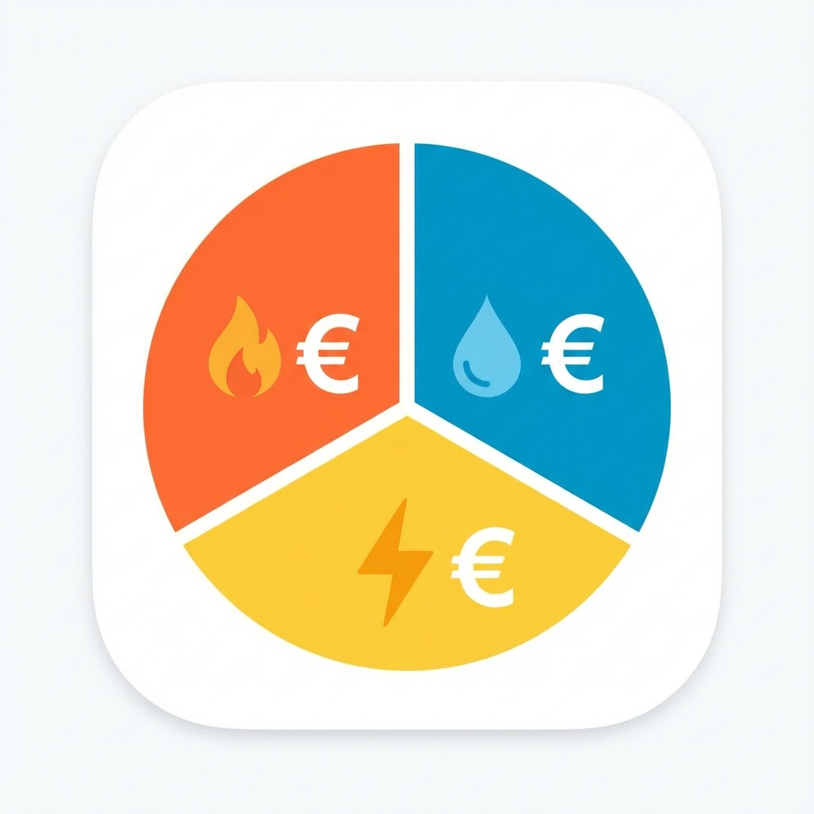

# ioBroker.nebenkosten-monitor

[](https://github.com/fischi87/ioBroker.nebenkosten-monitor/releases)
[](https://github.com/fischi87/ioBroker.nebenkosten-monitor/blob/main/LICENSE)
[](https://github.com/fischi87/ioBroker.nebenkosten-monitor/actions)
[](https://paypal.me/bigplay87)

## Nebenkosten-Monitor Adapter für ioBroker

Überwacht Gas-, Wasser- und Stromverbrauch mit automatischer Kostenberechnung, Abschlagsüberwachung und detaillierten Statistiken.

### ✨ Hauptfunktionen

- 📊 **Verbrauchsüberwachung** für Gas, Wasser und Strom
- 💰 **Automatische Kostenberechnung** mit Arbeitspreis und Grundgebühr
- 💳 **Abschlagsüberwachung** - Sehe sofort ob Nachzahlung oder Guthaben droht
- 🔄 **Flexible Sensoren** - Nutzt vorhandene Sensoren (Shelly, Tasmota, Homematic, etc.)
- ⚡ **HT/NT-Tarife** - Volle Unterstützung für Hoch- und Nebentarife (Tag/Nacht)
- 🔄 **Gas-Spezial** - Automatische Umrechnung von m³ in kWh
- 🕛 **Automatische Resets** - Täglich, monatlich und jährlich (Vertragsjubiläum)
- 🔔 **Intelligente Benachrichtigungen** - Getrennte Erinnerungen für Abrechnungsende (Zählerstand) und Vertragswechsel (Tarif-Check) mit einstellbaren Vorlaufzeiten.

---

## 💝 Support

Gefällt dir dieser Adapter? Du kannst mich gerne mit einem Kaffee unterstützen! ☕

[](https://paypal.me/bigplay87)

---

## 🚀 Schnellstart

### 1. Installation

1. Adapter über die ioBroker Admin-Oberfläche installieren
2. Instanz erstellen
3. Konfiguration öffnen

### 2. Grundkonfiguration (Beispiel: Gas)

1. ✅ **Gas-Überwachung aktivieren**
2. 🔍 **Sensor auswählen** - Deinen Gaszähler-Sensor (in m³)
3. 📝 **Zählerstand bei Vertragsbeginn** - z.B. 10250 m³ (für korrekte Jahresberechnung)
4. 📅 **Vertragsbeginn** - z.B. 01.01.2026 (für korrekten Jahresreset und Abschlagsberechnung)
5. 🔧 **Offset** _(optional)_ - Falls dein Hardware-Zähler nicht bei 0 startet
6. 🔥 **Brennwert & Z-Zahl** - Von deiner Gasrechnung (z.B. 11,5 und 0,95)
7. 💶 **Preise eintragen**:
    - Arbeitspreis: 0,1835 €/kWh
    - Grundgebühr: 15,03 €/Monat
    - Jahresgebühr: 60,00 €/Jahr (z.B. Zählermiete)
8. 💳 **Abschlag** - Monatliche Vorauszahlung (z.B. 150 €)

**Fertig!** Der Adapter berechnet nun automatisch alle Kosten! 🎉

---

## 📊 Datenpunkte erklärt

Für jede aktivierte Verbrauchsart (Gas/Wasser/Strom) werden folgende Ordner angelegt:

### 🗂️ **consumption** (Verbrauch)

| Datenpunkt      | Beschreibung                                          | Beispiel         |
| --------------- | ----------------------------------------------------- | ---------------- |
| `daily`         | Verbrauch **heute** (seit 00:00 Uhr)                  | 12,02 kWh        |
| `dailyVolume`   | Verbrauch heute in m³                                 | 1,092 m³         |
| `monthly`       | Verbrauch **diesen Monat** (seit 1. des Monats)       | 117,77 kWh       |
| `monthlyVolume` | Monatlicher Verbrauch in m³                           | 10,69 m³         |
| `yearly`        | Verbrauch **seit Vertragsbeginn** (this billing year) | 730,01 kWh       |
| `yearlyVolume`  | Jahresverbrauch in m³                                 | 66,82 m³         |
| `dailyHT`       | Tagesverbrauch im **Haupttarif** (HT)                 | 8,40 kWh         |
| `dailyNT`       | Tagesverbrauch im **Nebentarif** (NT)                 | 3,62 kWh         |
| `monthlyHT`     | Monatsverbrauch im HT                                 | 82,15 kWh        |
| `monthlyNT`     | Monatsverbrauch im NT                                 | 35,62 kWh        |
| `yearlyHT`      | Jahresverbrauch im HT                                 | 511,00 kWh       |
| `yearlyNT`      | Jahresverbrauch im NT                                 | 219,01 kWh       |
| `lastUpdate`    | Letzte Aktualisierung                                 | 06.01.2026 14:11 |

**💡 Tipp:** `yearly` wird automatisch als `(Aktueller Zählerstand - Offset) - Initial Reading` berechnet!

**📅 Wichtig:** Der Jahresreset erfolgt am **Vertragsbeginn-Datum** (z.B. 12. Mai), NICHT am 1. Januar!

---

### 💰 **costs** (Kosten)

| Datenpunkt    | Was ist das?                                                  | Berechnung                                 | Beispiel                       |
| ------------- | ------------------------------------------------------------- | ------------------------------------------ | ------------------------------ |
| `daily`       | Kosten **heute**                                              | daily × Arbeitspreis                       | 2,27 €                         |
| `monthly`     | Kosten **diesen Monat**                                       | monthly × Arbeitspreis                     | 21,61 €                        |
| `yearly`      | **Verbrauchskosten** seit Vertragsbeginn                      | yearly × Arbeitspreis                      | 137,61 €                       |
| `totalYearly` | **Gesamtkosten Jahr** (Verbrauch + alle Fixkosten)            | yearly-cost + basicCharge + annualFee      | 162,64 €                       |
| `basicCharge` | **Grundgebühr akkumuliert** (inkl. Jahresgebühr anteilig)     | (Grundgebühr + (Jahresgebühr/12)) × Monate | 19,20 €                        |
| `annualFee`   | **Jahresgebühr akkumuliert**                                  | (Jahresgebühr / 12) × Monate               | 4,17 €                         |
| `paidTotal`   | **Bezahlt** via Abschlag                                      | Abschlag × Monate                          | 150,00 €                       |
| `balance`     | **🎯 WICHTIGSTER Wert!**<br>Nachzahlung (+) oder Guthaben (-) | totalYearly - paidTotal                    | **+12,64 €**<br>→ Nachzahlung! |

#### 🔍 **balance** genauer erklärt:

- **Positiv (+50 €)** → ❌ **Nachzahlung**: Du musst am Jahresende zahlen
- **Negativ (-24 €)** → ✅ **Guthaben**: Du bekommst Geld zurück
- **Null (0 €)** → ⚖️ **Ausgeglichen**: Verbrauch = Abschlag

**Beispiel:**

```
Verbrauchskosten:  137,61 € (yearly)
Grundgebühr:      + 15,03 € (basicCharge)
────────────────────────────
Gesamtkosten:      152,64 €

Bezahlt (Abschlag): 150,00 € (paidTotal)
────────────────────────────
Balance:           +2,64 € → Nachzahlung
```

---

### ℹ️ **info** (Informationen)

| Datenpunkt           | Beschreibung                 | Beispiel         |
| -------------------- | ---------------------------- | ---------------- |
| `currentPrice`       | Aktueller Arbeitspreis       | 0,1885 €/kWh     |
| `meterReading`       | Zählerstand in kWh           | 112711,26 kWh    |
| `meterReadingVolume` | Zählerstand in m³ (nur Gas)  | 10305,03 m³      |
| `lastSync`           | Letzte Sensor-Aktualisierung | 06.01.2026 14:11 |
| `sensorActive`       | Sensor verbunden?            | ✅ true          |

---

### 📈 **statistics** (Statistiken)

| Datenpunkt       | Beschreibung                         |
| ---------------- | ------------------------------------ |
| `averageDaily`   | Durchschnittlicher Tagesverbrauch    |
| `averageMonthly` | Durchschnittlicher Monatsverbrauch   |
| `lastDayStart`   | Letzter Tages-Reset (00:00 Uhr)      |
| `lastMonthStart` | Letzter Monats-Reset (1. des Monats) |
| `lastYearStart`  | Vertragsbeginn / Jahresstart         |

---

### 📅 **billing** (Abrechnungszeitraum)

| Datenpunkt          | Beschreibung                             | Beispiel    |
| ------------------- | ---------------------------------------- | ----------- |
| `endReading`        | Endzählerstand (manuell eintragen)       | 10316.82 m³ |
| `closePeriod`       | Zeitraum jetzt abschließen (Button)      | true/false  |
| `periodEnd`         | Abrechnungszeitraum endet am             | 01.01.2027  |
| `daysRemaining`     | Tage bis Abrechnungsende                 | 359 Tage    |
| `newInitialReading` | Neuer Startwert (für Config übernehmen!) | 10316.82 m³ |

**💡 Workflow am Jahresende:**

1. Physischen Zähler ablesen (z.B. 10316.82 m³)
2. Wert in `endReading` eintragen
3. `closePeriod` auf `true` setzen
4. ✅ Adapter archiviert automatisch alle Daten in `history.{JAHR}.*`
5. ⚠️ **Wichtig:** Config aktualisieren mit neuem `initialReading` (siehe `newInitialReading`)

---

### 📊 **history** (Jahres-Historie)

| Datenpunkt                  | Beschreibung                            | Beispiel   |
| --------------------------- | --------------------------------------- | ---------- |
| `history.2024.yearly`       | Jahresverbrauch 2024                    | 730.01 kWh |
| `history.2024.yearlyVolume` | Jahresverbrauch 2024 in m³ (Gas/Wasser) | 66.82 m³   |
| `history.2024.totalYearly`  | Gesamtkosten 2024                       | 162.64 €   |
| `history.2024.balance`      | Bilanz 2024 (Nachzahlung/Guthaben)      | +12.64 €   |

**💡 Automatische Archivierung:**

- Wird beim Abschluss des Abrechnungszeitraums erstellt
- Speichert alle wichtigen Jahreshöchstwerte inkl. HT/NT
- Ermöglicht Jahresvergleiche

---

### 🔧 **adjustment** (Manuelle Anpassung)

Korrigiere Sensor-Abdrift durch manuelle Anpassung.

| Datenpunkt | Beschreibung                         | Beispiel  |
| ---------- | ------------------------------------ | --------- |
| `value`    | Korrekturwert (Differenz zum Zähler) | +4.2 m³   |
| `note`     | Notiz/Grund für Anpassung (optional) | "Ausfall" |
| `applied`  | Zeitstempel der letzten Anwendung    | 17035...  |

**💡 Workflow:**

1. Physischen Zähler ablesen: **10350 m³**
2. Adapter zeigt: **10346 m³**
3. Differenz in `adjustment.value` eintragen: **+4**
4. ✅ Alle Berechnungen werden automatisch korrigiert.
5. **Dank der HT/NT-Integration** werden Anpassungen bei HT/NT-Tarifen automatisch dem Haupttarif (HT) angerechnet.

---

## ⚙️ Spezialfunktionen

### ⚡ Gas: m³ → kWh Umrechnung

Gasverbrauch wird in **m³ gemessen**, aber in **kWh abgerechnet**.

**Formel:** `kWh = m³ × Brennwert × Z-Zahl`

💡 **Tipp:** Brennwert und Z-Zahl findest du auf deiner Gasrechnung!

---

### 🔄 Automatische Resets

Der Adapter setzt Zähler automatisch zurück:

| Zeitpunkt             | Was passiert  | Beispiel            |
| --------------------- | ------------- | ------------------- |
| **00:00 Uhr** täglich | `daily` → 0   | Neuer Tag beginnt   |
| **1. des Monats**     | `monthly` → 0 | Neuer Monat beginnt |
| **Vertragsjubiläum**  | `yearly` → 0  | Abrechnungsjahr neu |

---

## Changelog

### 1.3.0 (2026-01-09)

- **NEW:** **Differenzierte Benachrichtigungen** - Zwei getrennte Erinnerungstypen:
    - **Abrechnungsende**: Erinnerung zum Zählerstand ablesen (z.B. 7 Tage vorher).
    - **Vertragswechsel**: Erinnerung zum Tarif-Check / Kündigen (z.B. 60 Tage vorher).
- **NEW:** **Interaktives Benachrichtigungs-Feedback** - Der Test-Button zeigt nun direkt Erfolgs- oder Fehlermeldungen via Popup an (inkl. SMTP-Fehler vom Email-Adapter).
- **NEW:** **Live-Test ohne Speichern** - Benachrichtigungen können jetzt sofort getestet werden, ohne die Konfiguration vorher speichern zu müssen.
- **NEW:** **Modularer Code-Aufbau** - Umstellung auf eine moderne Architektur mit spezialisierten Managern für bessere Performance und Wartbarkeit.
- **IMPROVED:** **Responsives Admin-UI** - Kompakteres Button-Design und optimierte Darstellung auf mobilen Geräten.
- **FIX:** Redundante Volumen-Datenpunkte (`dailyVolume` etc.) für Strom und Wasser entfernt, um Log-Warnungen zu vermeiden.
- **FIX:** Mandatory bot requirements (Changelog header, News cleanup).

### 1.2.7 (2026-01-08)

- **NEW:** Universelles Benachrichtigungssystem für Abrechnungszeitraum-Erinnerungen (Telegram, Pushover, Email, etc.)
- **NEW:** Optionale PayPal-Unterstützung (Links in README und Config)
- **FIX:** Dezimalstellen für Tagesverbrauch auf 3 erhöht (bessere Unterstützung für Sensoren mit kleinen Deltas wie Shelly)
- **FIX:** Erlauben von leeren Preisen/Gebühren in der Konfiguration (verhindert Speicher-Fehler)

### 1.2.6 (2026-01-08)

- **FIX:** Erlaube leere Felder für Grundgebühr/Jahresgebühr/Abschlag in der Konfiguration (verhindert Speicher-Block im Admin-UI)

### 1.2.5 (2026-01-08)

- **NEW:** Transparente Anzeige des Vertragsbeginns bei jedem Adapter-Start im Log
- **NEW:** Unterstützung für zusätzliche **Jahresgebühren** (z.B. Zählermiete)
- **NEW:** Datenpunkt `costs.totalYearly` für die echten Gesamtkosten
- **FIX:** Kritischer Fehler in der Verbrauchs-Delta-Berechnung behoben (v1.2.4)
- **FIX:** Arbeitspreis-Anzeige bei Strom korrigiert
- **FIX:** Gas m³ → kWh Umrechnung für Anpassungswerte
- **FIX:** Korrekte Initialisierung des Vertragsjahres bei Neustart
- **FIX:** Vereinheitlichung der Konfigurationsschlüssel (`wasserInitialReading`)
- **ROBUSTNESS:** Schutz vor Datenverlust bei Adapter-Neustart (Zählerstand-Persistierung)
- **ROBUSTNESS:** Integration von manuellen Anpassungen in die HT/NT-Kostenrechnung
- **NEW:** Volle Unterstützung für **HT/NT-Tarife** für alle Energieträger (Strom, Gas, Wasser)
- **NEW:** Automatische Archivierung von HT/NT-Verbräuchen und Kosten in der Historie
- **DOCS:** Internationalisierung von Titel und Beschreibung

### 1.2.2 (2026-01-08)

- **NEW:** Manuelle Anpassung für Sensor-Abdrift-Korrektur
- **NEW:** Abrechnungszeitraum-Management mit automatischer Archivierung
- **NEW:** Unterstützung für zusätzliche **Jahresgebühren** (z.B. Zählermiete)
- **NEW:** Datenpunkt `costs.totalYearly` für die echten Gesamtkosten
- **FIX:** Arbeitspreis-Anzeige bei Strom korrigiert
- **FIX:** Gas m³ → kWh Umrechnung für Anpassungswerte
- **DOCS:** Internationalisierung von Titel und Beschreibung

---

- Initial release

---

## License

MIT License

Copyright (c) 2026 fischi87 <axel.fischer@hotmail.com>
